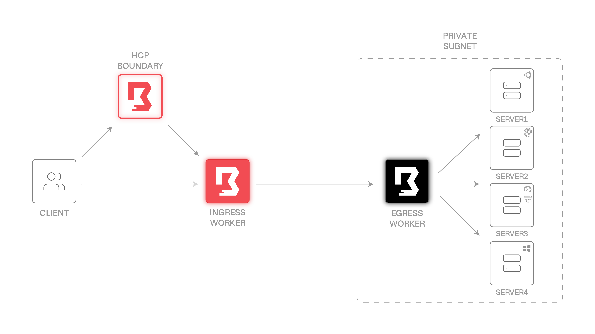

# HCP Boundary with self-managed workers

## Synopsis

Get secure access to your private resources through HCP Boundary. Other than traditional solutions like jump-boxes or VPN's, (a part of) Boundary does not need any ingress firewall rules. Instead, it only needs egress access to an upstream worker.  

## Requirements

This repository is meant for using during a live demo and expects:

- You have Terraform installed locally
- You have access to HCP
- You have a valid Azure subscription
- You are already authenticated through `az login`

## Schematic overview



## Terraform

Terraform will provision the following:  

### Azure

- 5 Network interfaces
- 1 Network security group
- 1 Public IP address
- 1 Resource group
- 1 Storage account
- 2 TLS keys
- 5 Virtual machines
- 2 Virtual networks
- 2 Virtual subnets

### Local

- 3 local files

## Post deployment

### HCP Boundary (1)

1. Navigate to <https://portal.cloud.hashicorp.com>
2. Create HCP Boundary Cluster
3. Copy Cluster URL
   ```shell
   export BOUNDARY_ADDR=<cluster_url>
   ```
4. Click on Auth Methods and copy the ID for the *password* auth method
   ```shell
   export BOUNDARY_AUTH_METHOD_ID=<auth_method_id>
   ```

### Ingress worker

1. Use the worker user to log into the ingress worker with SSH
2. Install the `boundary-worker-hcp` package
   ```shell
   wget -O- https://apt.releases.hashicorp.com/gpg | gpg --dearmor | sudo tee /usr/share/keyrings/hashicorp-archive-keyring.gpg >/dev/null
   echo "deb [signed-by=/usr/share/keyrings/hashicorp-archive-keyring.gpg] https://apt.releases.hashicorp.com $(lsb_release -cs) main" | sudo tee /etc/apt/sources.list.d/hashicorp.list
   sudo apt update && sudo apt install boundary-worker-hcp
   ```
3. Ensure directory structure
   ```shell
   sudo rm /etc/boundary.d/*
   sudo mkdir /opt/boundary
   sudo chown boundary:boundary /etc/boundary.d
   sudo chown boundary:boundary /opt/boundary
   ```
4. Create configuration
   ```shell
   sudo tee /etc/boundary.d/ingress-worker.hcl > /dev/null << EOF
   disable_mlock           = true
   hcp_boundary_cluster_id = "<cluster-id>"
   
   listener "tcp" {
     address = "0.0.0.0:9202"
     purpose = "proxy"
   }
   
   worker {
     public_addr        = "<external-addr>"
     auth_storage_path = "/opt/boundary/ingress-worker"
     tags {
       type = ["ingress"]
     }
   }
   EOF
   ```
   Replace `<cluster-id>` with the HCP Boundary Cluster ID.  
   Replace `<external-addr>` with the public IP address of this VM.
5. Create systemd unit file
   ```shell
   sudo tee /usr/lib/systemd/system/boundary-worker.service > /dev/null << EOF
   [Unit]
   Description=Boundary Worker Service
   Wants=network-online.target
   After=network-online.target
   
   [Service]
   User=boundary
   Group=boundary
   Type=simple
   ExecStart=/usr/bin/boundary-worker server -config="/etc/boundary.d/ingress-worker.hcl"
   
   [Install]
   WantedBy=multi-user.target
   EOF
   ```
6. Ensure service
   ```shell
   sudo systemctl daemon-reload
   sudo systemctl enable --now boundary-worker
   ```
7. Copy *Worker Auth Registration Request*
   ```shell
   sudo systemctl status boundary-worker | less
   ```
   Look for the *Worker Auth Registration Request* and copy this value.
8. Register the worker in HCP Boundary  
   Leave all the fields blank, except for the *Worker Auth Registration Request*.  
   Rename the resource to `worker-ingress` for easy recognition.

### Egress worker

1. Log into Azure Portal
2. Navigate to the `worker-egress` virtual machine
3. Reset the password for the worker admin user
4. Navigate to the serial console
5. Log in with the worker admin user
6. Install the `boundary-worker-hcp` package
   ```shell
   wget -O- https://apt.releases.hashicorp.com/gpg | gpg --dearmor | sudo tee /usr/share/keyrings/hashicorp-archive-keyring.gpg >/dev/null
   echo "deb [signed-by=/usr/share/keyrings/hashicorp-archive-keyring.gpg] https://apt.releases.hashicorp.com $(lsb_release -cs) main" | sudo tee /etc/apt/sources.list.d/hashicorp.list
   sudo apt update && sudo apt install boundary-worker-hcp
   ```
7. Ensure directory structure
   ```shell
   sudo rm /etc/boundary.d/*
   sudo mkdir /opt/boundary
   sudo chown boundary:boundary /etc/boundary.d
   sudo chown boundary:boundary /opt/boundary
   ```
8. Create configuration
   ```shell
   sudo tee /etc/boundary.d/egress-worker.hcl > /dev/null << EOF
   disable_mlock = true
   
   listener "tcp" {
     address = "0.0.0.0:9203"
     purpose = "proxy"
   }
   
   worker {
     initial_upstreams = ["<ingress-worker-ip>:9202"]
     auth_storage_path = "/opt/boundary/egress-worker"
     tags {
       type = ["egress"]
     }
   }
   EOF
   ```
   Replace `<ingress-worker-ip>` with the public IP address of the ingress worker created in the previous segment.
9. Create systemd unit file
   ```shell
   sudo tee /usr/lib/systemd/system/boundary-worker.service > /dev/null << EOF
   [Unit]
   Description=Boundary Worker Service
   Wants=network-online.target
   After=network-online.target
   
   [Service]
   User=boundary
   Group=boundary
   Type=simple
   ExecStart=/usr/bin/boundary-worker server -config="/etc/boundary.d/egress-worker.hcl"
   
   [Install]
   WantedBy=multi-user.target
   EOF
   ```
10. Ensure service
   ```shell
   sudo systemctl daemon-reload
   sudo systemctl enable --now boundary-worker
   ```
11. Copy *Worker Auth Registration Request*
   ```shell
   sudo systemctl status boundary-worker | less
   ```
   Look for the *Worker Auth Registration Request* and copy this value.
12. Register the worker in HCP Boundary  
   Leave all the fields blank, except for the *Worker Auth Registration Request*.  
   Rename the resource to `worker-egress` for easy recognition.

### HCP Boundary (2)

1. Create an Org  
   Give the Org a name.
2. Create a Project  
   Give the Org a name.
3. Create an SSH Target  
   Set the default port to 22.  
   Set the default address to the private IP of `server1`.  
   Use `"ingress" in "/tags/type"` for the Ingress filter.  
   Use `"egress" in "/tags/type"` for the Egress filter.
5. Create a static Credentials Store  
   Give the Credentials Store a name.
6. Create a Credential  
   Give it the name serveradmin.  
   Select username & key pair.  
   Use the server admin user and use the `server.pem` local file contents. 
7. Go back to the Target  
   Inject the SSH credentials.

### Client

1. Authenticate to HCP Boundary
   ```shell
   boundary authenticate
   ```
   Be sure you have the `BOUNDARY_ADDR` and `BOUNDARY_AUTH_METHOD_ID` environment variables set.
3. Connect to the SSH target
   ```shell
   boundary connect ssh -target-id=<target-id>
   ```
